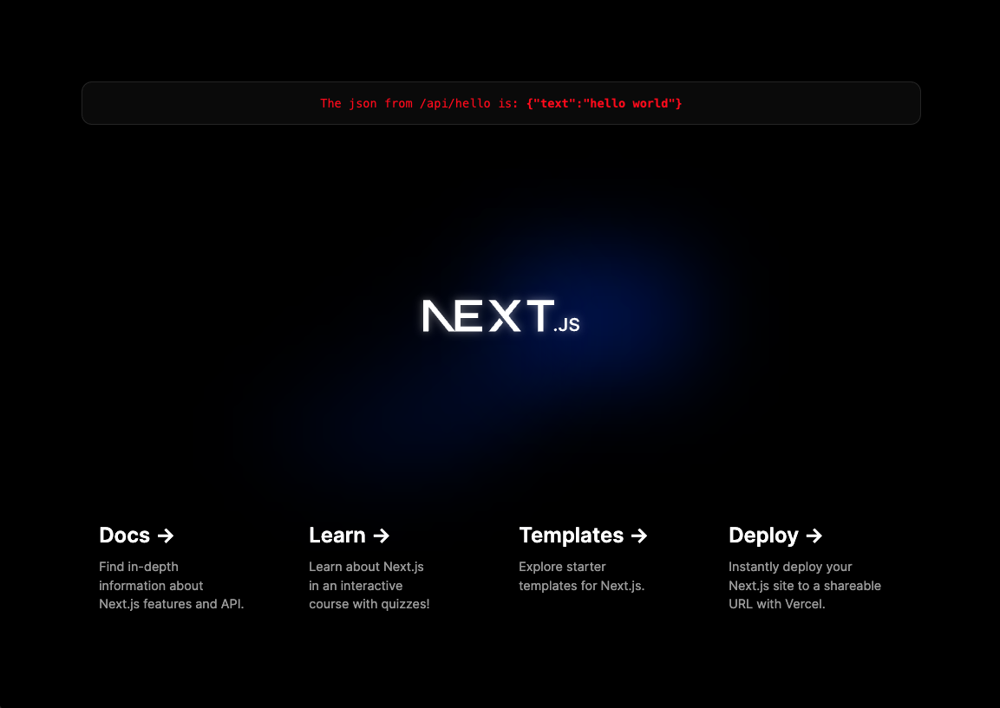

# Static Next.js app with Cloudflare Pages Functions example

This is a very minimal template/example showing how to build a static Next.js application
(using the [Next.js' static exports functionality](https://nextjs.org/docs/app/building-your-application/deploying/static-exports))
that also has server-side logic implemented via [Cloudflare Pages Functions](https://developers.cloudflare.com/pages/functions/).

The result is an SPA application that looks like the following:


where the red text at the top shows data obtained from a Pages Functions endpoint.

## Steps to run the application

- Install the dependencies:
    ```
    $ npm i
    ```

- Build the application and run it using `wrangler pages dev`:
    ```
    $ npm run preview
    ```

You can also deploy the application via:
```
$ npm run deploy
```
